# [📈 Live Status](https://whytspace.github.io/upptime): <!--live status--> **🟧 Partial outage**

This repository contains the open-source uptime monitor and status page for [David H.](https://whytspace.github.io/upptime), powered by [Upptime](https://github.com/upptime/upptime).

With [Upptime](https://upptime.js.org), you can get your own unlimited and free uptime monitor and status page, powered entirely by a GitHub repository. We use [Issues](https://github.com/whytspace/upptime/issues) as incident reports, [Actions](https://github.com/whytspace/upptime/actions) as uptime monitors, and [Pages](https://whytspace.github.io/upptime) for the status page.

<!--start: status pages-->
<!-- This summary is generated by Upptime (https://github.com/upptime/upptime) -->
<!-- Do not edit this manually, your changes will be overwritten -->
<!-- prettier-ignore -->
| URL | Status | History | Response Time | Uptime |
| --- | ------ | ------- | ------------- | ------ |
|  [Übersicht 🇩🇪 (de)](https://holiday-lescala.com/haeuser/) | 🟩 Up | [uebersicht-de.yml](https://github.com/whytspace/upptime-holiday-lescala/commits/HEAD/history/uebersicht-de.yml) | 

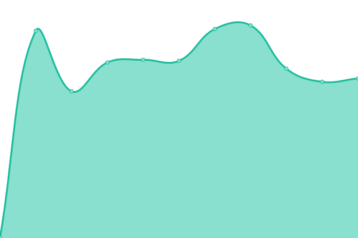 1199ms
     
 | 

<a href="https://whytspace.github.io/upptime-holiday-lescala/history/uebersicht-de">95.59%</a>
    

|  [Übersicht 🇬🇧 (en)](https://holiday-lescala.com/en/homes/) | 🟩 Up | [uebersicht-en.yml](https://github.com/whytspace/upptime-holiday-lescala/commits/HEAD/history/uebersicht-en.yml) | 

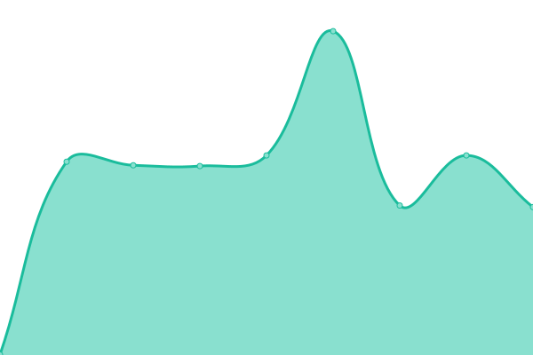 788ms
     
 | 

<a href="https://whytspace.github.io/upptime-holiday-lescala/history/uebersicht-en">95.65%</a>
    

|  [Übersicht 🇫🇷 (fr)](https://holiday-lescala.com/fr/maisons/) | 🟩 Up | [uebersicht-fr.yml](https://github.com/whytspace/upptime-holiday-lescala/commits/HEAD/history/uebersicht-fr.yml) | 

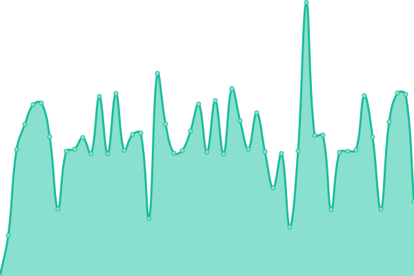 786ms
     
 | 

<a href="https://whytspace.github.io/upptime-holiday-lescala/history/uebersicht-fr">95.71%</a>
    

|  [Übersicht 🇪🇸 (es)](https://holiday-lescala.com/es/casas/) | 🟩 Up | [uebersicht-es.yml](https://github.com/whytspace/upptime-holiday-lescala/commits/HEAD/history/uebersicht-es.yml) | 

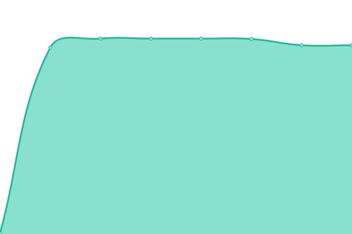 781ms
     
 | 

<a href="https://whytspace.github.io/upptime-holiday-lescala/history/uebersicht-es">95.76%</a>
    

|  [Bianya 🇩🇪 (de)](https://holiday-lescala.com/h/haus-bianya/) | 🟩 Up | [bianya-de.yml](https://github.com/whytspace/upptime-holiday-lescala/commits/HEAD/history/bianya-de.yml) | 

 841ms
     
 | 

<a href="https://whytspace.github.io/upptime-holiday-lescala/history/bianya-de">95.82%</a>
    

|  [Bianya 🇬🇧 (en)](https://holiday-lescala.com/en/h/house-bianya/) | 🟩 Up | [bianya-en.yml](https://github.com/whytspace/upptime-holiday-lescala/commits/HEAD/history/bianya-en.yml) | 

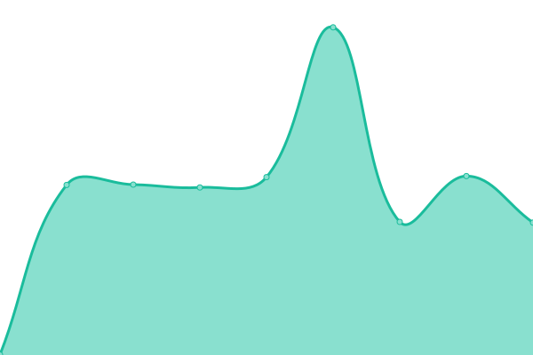 782ms
     
 | 

<a href="https://whytspace.github.io/upptime-holiday-lescala/history/bianya-en">95.88%</a>
    

|  [Bianya 🇫🇷 (fr)](https://holiday-lescala.com/fr/h/maison-bianya/) | 🟩 Up | [bianya-fr.yml](https://github.com/whytspace/upptime-holiday-lescala/commits/HEAD/history/bianya-fr.yml) | 

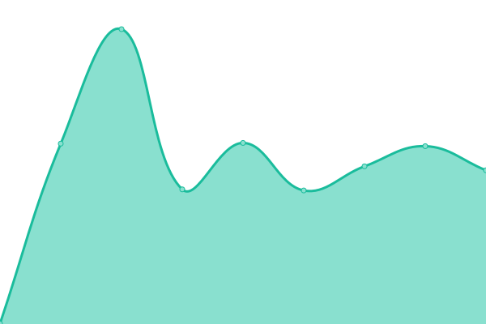 774ms
     
 | 

<a href="https://whytspace.github.io/upptime-holiday-lescala/history/bianya-fr">95.93%</a>
    

|  [Bianya 🇪🇸 (es)](https://holiday-lescala.com/es/h/casa-bianya/) | 🟩 Up | [bianya-es.yml](https://github.com/whytspace/upptime-holiday-lescala/commits/HEAD/history/bianya-es.yml) | 

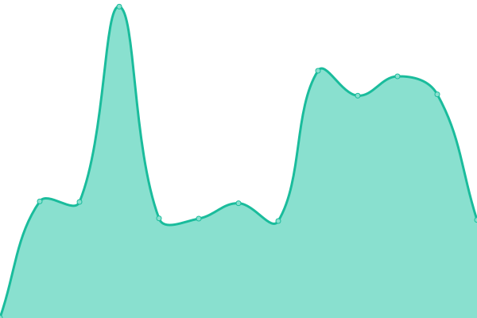 780ms
     
 | 

<a href="https://whytspace.github.io/upptime-holiday-lescala/history/bianya-es">95.99%</a>
    

|  [Girasol 🇩🇪 (de)](https://holiday-lescala.com/h/haus-girasol/) | 🟩 Up | [girasol-de.yml](https://github.com/whytspace/upptime-holiday-lescala/commits/HEAD/history/girasol-de.yml) | 

 768ms
     
 | 

<a href="https://whytspace.github.io/upptime-holiday-lescala/history/girasol-de">96.05%</a>
    

|  [Girasol 🇬🇧 (en)](https://holiday-lescala.com/en/h/house-girasol/) | 🟩 Up | [girasol-en.yml](https://github.com/whytspace/upptime-holiday-lescala/commits/HEAD/history/girasol-en.yml) | 

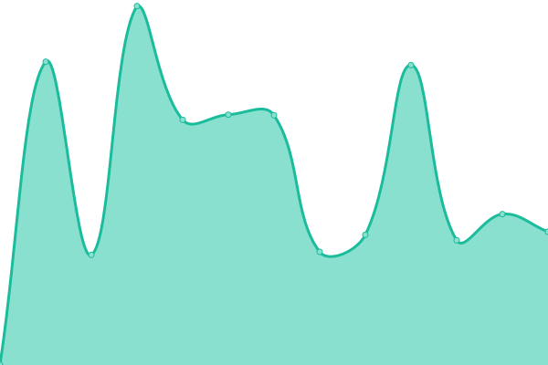 774ms
     
 | 

<a href="https://whytspace.github.io/upptime-holiday-lescala/history/girasol-en">96.11%</a>
    

|  [Girasol 🇫🇷 (fr)](https://holiday-lescala.com/fr/h/maison-girasol/) | 🟩 Up | [girasol-fr.yml](https://github.com/whytspace/upptime-holiday-lescala/commits/HEAD/history/girasol-fr.yml) | 

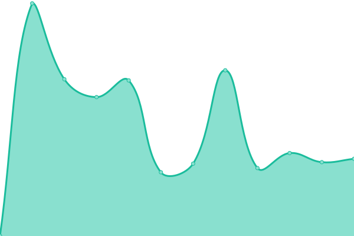 777ms
     
 | 

<a href="https://whytspace.github.io/upptime-holiday-lescala/history/girasol-fr">96.16%</a>
    

|  [Girasol 🇪🇸 (es)](https://holiday-lescala.com/es/h/casa-girasol/) | 🟩 Up | [girasol-es.yml](https://github.com/whytspace/upptime-holiday-lescala/commits/HEAD/history/girasol-es.yml) | 

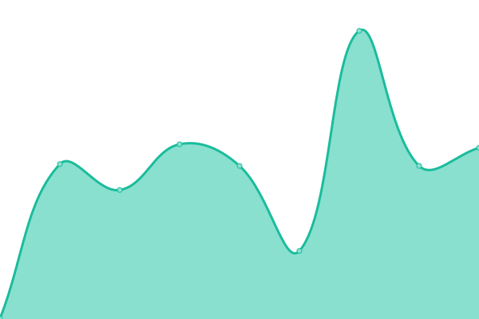 770ms
     
 | 

<a href="https://whytspace.github.io/upptime-holiday-lescala/history/girasol-es">96.22%</a>
    

|  [Olives 🇩🇪 (de)](https://holiday-lescala.com/h/haus-olives/) | 🟩 Up | [olives-de.yml](https://github.com/whytspace/upptime-holiday-lescala/commits/HEAD/history/olives-de.yml) | 

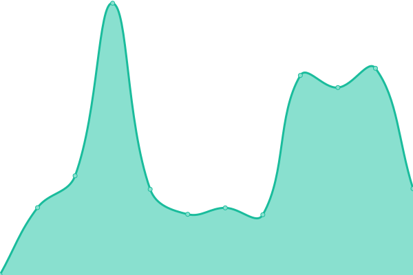 740ms
     
 | 

<a href="https://whytspace.github.io/upptime-holiday-lescala/history/olives-de">96.28%</a>
    

|  [Olives 🇬🇧 (en)](https://holiday-lescala.com/en/h/house-olives/) | 🟩 Up | [olives-en.yml](https://github.com/whytspace/upptime-holiday-lescala/commits/HEAD/history/olives-en.yml) | 

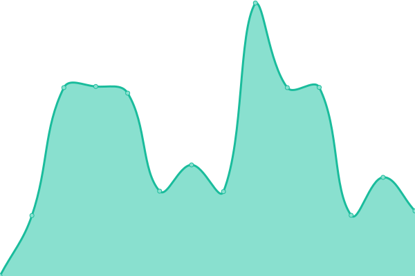 740ms
     
 | 

<a href="https://whytspace.github.io/upptime-holiday-lescala/history/olives-en">96.34%</a>
    

|  [Olives 🇫🇷 (fr)](https://holiday-lescala.com/fr/h/maison-olives/) | 🟩 Up | [olives-fr.yml](https://github.com/whytspace/upptime-holiday-lescala/commits/HEAD/history/olives-fr.yml) | 

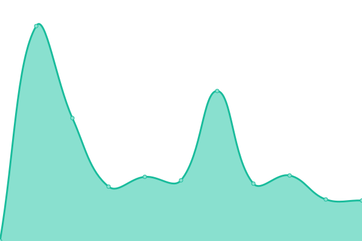 777ms
     
 | 

<a href="https://whytspace.github.io/upptime-holiday-lescala/history/olives-fr">96.39%</a>
    

|  [Olives 🇪🇸 (es)](https://holiday-lescala.com/es/h/casa-olives/) | 🟩 Up | [olives-es.yml](https://github.com/whytspace/upptime-holiday-lescala/commits/HEAD/history/olives-es.yml) | 

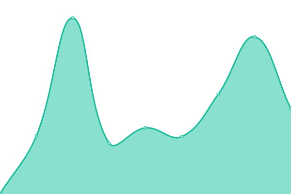 745ms
     
 | 

<a href="https://whytspace.github.io/upptime-holiday-lescala/history/olives-es">96.45%</a>
    

|  [Francoli 🇩🇪 (de)](https://holiday-lescala.com/h/haus-francoli/) | 🟩 Up | [francoli-de.yml](https://github.com/whytspace/upptime-holiday-lescala/commits/HEAD/history/francoli-de.yml) | 

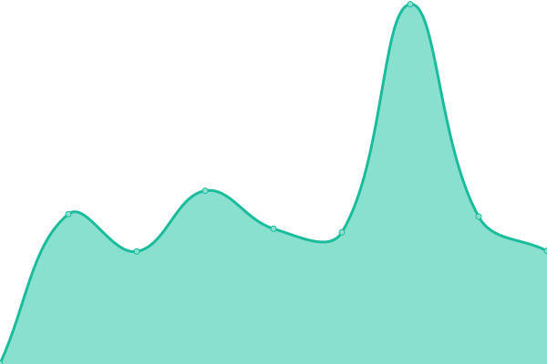 785ms
     
 | 

<a href="https://whytspace.github.io/upptime-holiday-lescala/history/francoli-de">96.51%</a>
    

|  [Francoli 🇬🇧 (en)](https://holiday-lescala.com/en/h/house-francoli/) | 🟩 Up | [francoli-en.yml](https://github.com/whytspace/upptime-holiday-lescala/commits/HEAD/history/francoli-en.yml) | 

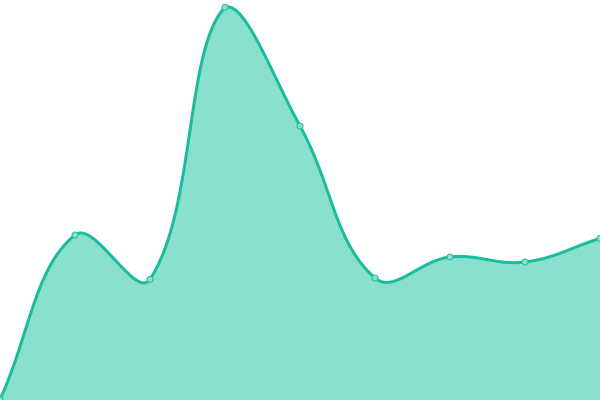 793ms
     
 | 

<a href="https://whytspace.github.io/upptime-holiday-lescala/history/francoli-en">96.56%</a>
    

|  [Francoli 🇫🇷 (fr)](https://holiday-lescala.com/fr/h/maison-francoli/) | 🟩 Up | [francoli-fr.yml](https://github.com/whytspace/upptime-holiday-lescala/commits/HEAD/history/francoli-fr.yml) | 

 777ms
     
 | 

<a href="https://whytspace.github.io/upptime-holiday-lescala/history/francoli-fr">96.62%</a>
    

|  [Francoli 🇪🇸 (es)](https://holiday-lescala.com/es/h/casa-francoli/) | 🟩 Up | [francoli-es.yml](https://github.com/whytspace/upptime-holiday-lescala/commits/HEAD/history/francoli-es.yml) | 

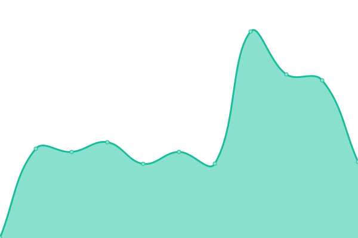 834ms
     
 | 

<a href="https://whytspace.github.io/upptime-holiday-lescala/history/francoli-es">96.68%</a>
    

|  [Terany 🇩🇪 (de)](https://holiday-lescala.com/h/haus-terany/) | 🟩 Up | [terany-de.yml](https://github.com/whytspace/upptime-holiday-lescala/commits/HEAD/history/terany-de.yml) | 

 747ms
     
 | 

<a href="https://whytspace.github.io/upptime-holiday-lescala/history/terany-de">96.74%</a>
    

|  [Terany 🇬🇧 (en)](https://holiday-lescala.com/en/h/house-terany/) | 🟩 Up | [terany-en.yml](https://github.com/whytspace/upptime-holiday-lescala/commits/HEAD/history/terany-en.yml) | 

 756ms
     
 | 

<a href="https://whytspace.github.io/upptime-holiday-lescala/history/terany-en">96.79%</a>
    

|  [Terany 🇫🇷 (fr)](https://holiday-lescala.com/fr/h/maison-terany/) | 🟩 Up | [terany-fr.yml](https://github.com/whytspace/upptime-holiday-lescala/commits/HEAD/history/terany-fr.yml) | 

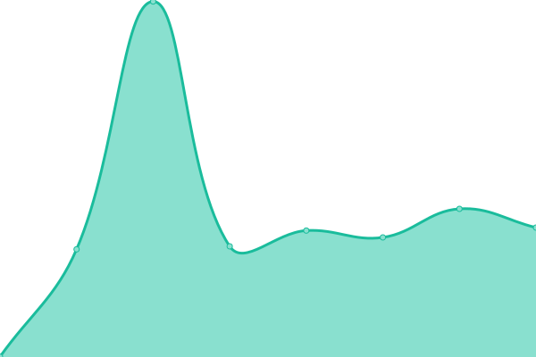 757ms
     
 | 

<a href="https://whytspace.github.io/upptime-holiday-lescala/history/terany-fr">96.85%</a>
    

|  [Terany 🇪🇸 (es)](https://holiday-lescala.com/es/h/casa-terany/) | 🟩 Up | [terany-es.yml](https://github.com/whytspace/upptime-holiday-lescala/commits/HEAD/history/terany-es.yml) | 

 730ms
     
 | 

<a href="https://whytspace.github.io/upptime-holiday-lescala/history/terany-es">96.91%</a>
    

|  [Roca 🇩🇪 (de)](https://holiday-lescala.com/h/haus-roca/) | 🟩 Up | [roca-de.yml](https://github.com/whytspace/upptime-holiday-lescala/commits/HEAD/history/roca-de.yml) | 

 758ms
     
 | 

<a href="https://whytspace.github.io/upptime-holiday-lescala/history/roca-de">96.96%</a>
    

|  [Roca 🇬🇧 (en)](https://holiday-lescala.com/en/h/house-roca/) | 🟩 Up | [roca-en.yml](https://github.com/whytspace/upptime-holiday-lescala/commits/HEAD/history/roca-en.yml) | 

 759ms
     
 | 

<a href="https://whytspace.github.io/upptime-holiday-lescala/history/roca-en">97.02%</a>
    

|  [Roca 🇫🇷 (fr)](https://holiday-lescala.com/fr/h/maison-roca/) | 🟩 Up | [roca-fr.yml](https://github.com/whytspace/upptime-holiday-lescala/commits/HEAD/history/roca-fr.yml) | 

 771ms
     
 | 

<a href="https://whytspace.github.io/upptime-holiday-lescala/history/roca-fr">97.08%</a>
    

|  [Roca 🇪🇸 (es)](https://holiday-lescala.com/es/h/casa-roca/) | 🟩 Up | [roca-es.yml](https://github.com/whytspace/upptime-holiday-lescala/commits/HEAD/history/roca-es.yml) | 

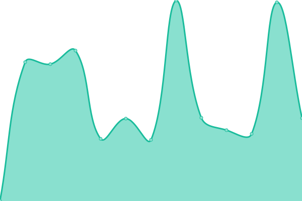 752ms
     
 | 

<a href="https://whytspace.github.io/upptime-holiday-lescala/history/roca-es">97.28%</a>
    

|  [Ancora 🇩🇪 (de)](https://holiday-lescala.com/h/haus-ancora/) | 🟥 Down | [ancora-de.yml](https://github.com/whytspace/upptime-holiday-lescala/commits/HEAD/history/ancora-de.yml) | 

 1146ms
     
 | 

<a href="https://whytspace.github.io/upptime-holiday-lescala/history/ancora-de">0.00%</a>
    

|  [Ancora 🇬🇧 (en)](https://holiday-lescala.com/en/h/house-ancora/) | 🟩 Up | [ancora-en.yml](https://github.com/whytspace/upptime-holiday-lescala/commits/HEAD/history/ancora-en.yml) | 

 900ms
     
 | 

<a href="https://whytspace.github.io/upptime-holiday-lescala/history/ancora-en">97.38%</a>
    

|  [Ancora 🇫🇷 (fr)](https://holiday-lescala.com/fr/h/maison-ancora/) | 🟥 Down | [ancora-fr.yml](https://github.com/whytspace/upptime-holiday-lescala/commits/HEAD/history/ancora-fr.yml) | 

 1080ms
     
 | 

<a href="https://whytspace.github.io/upptime-holiday-lescala/history/ancora-fr">0.00%</a>
    

|  [Ancora 🇪🇸 (es)](https://holiday-lescala.com/es/h/casa-ancora/) | 🟩 Up | [ancora-es.yml](https://github.com/whytspace/upptime-holiday-lescala/commits/HEAD/history/ancora-es.yml) | 

 934ms
     
 | 

<a href="https://whytspace.github.io/upptime-holiday-lescala/history/ancora-es">97.49%</a>
    

|  [Can Llop 🇩🇪 (de)](https://holiday-lescala.com/h/haus-can-llop/) | 🟥 Down | [can-llop-de.yml](https://github.com/whytspace/upptime-holiday-lescala/commits/HEAD/history/can-llop-de.yml) | 

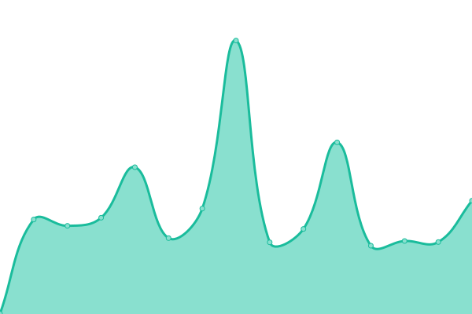 1065ms
     
 | 

<a href="https://whytspace.github.io/upptime-holiday-lescala/history/can-llop-de">0.00%</a>
    

|  [Can Llop 🇬🇧 (en)](https://holiday-lescala.com/en/h/house-can-llop/) | 🟥 Down | [can-llop-en.yml](https://github.com/whytspace/upptime-holiday-lescala/commits/HEAD/history/can-llop-en.yml) | 

 1092ms
     
 | 

<a href="https://whytspace.github.io/upptime-holiday-lescala/history/can-llop-en">0.00%</a>
    

|  [Can Llop 🇫🇷 (fr)](https://holiday-lescala.com/fr/h/maison-can-llop/) | 🟥 Down | [can-llop-fr.yml](https://github.com/whytspace/upptime-holiday-lescala/commits/HEAD/history/can-llop-fr.yml) | 

 1077ms
     
 | 

<a href="https://whytspace.github.io/upptime-holiday-lescala/history/can-llop-fr">0.00%</a>
    

|  [Can Llop 🇪🇸 (es)](https://holiday-lescala.com/es/h/casa-can-llop/) | 🟥 Down | [can-llop-es.yml](https://github.com/whytspace/upptime-holiday-lescala/commits/HEAD/history/can-llop-es.yml) | 

 1074ms
     
 | 

<a href="https://whytspace.github.io/upptime-holiday-lescala/history/can-llop-es">0.00%</a>
    

|  [El Gall 🇩🇪 (de)](https://holiday-lescala.com/h/haus-el-gall/) | 🟩 Up | [el-gall-de.yml](https://github.com/whytspace/upptime-holiday-lescala/commits/HEAD/history/el-gall-de.yml) | 

 342ms
     
 | 

<a href="https://whytspace.github.io/upptime-holiday-lescala/history/el-gall-de">97.88%</a>
    

|  [El Gall 🇬🇧 (en)](https://holiday-lescala.com/en/h/house-el-gall/) | 🟩 Up | [el-gall-en.yml](https://github.com/whytspace/upptime-holiday-lescala/commits/HEAD/history/el-gall-en.yml) | 

 741ms
     
 | 

<a href="https://whytspace.github.io/upptime-holiday-lescala/history/el-gall-en">97.92%</a>
    

|  [El Gall 🇫🇷 (fr)](https://holiday-lescala.com/fr/h/maison-el-gall/) | 🟩 Up | [el-gall-fr.yml](https://github.com/whytspace/upptime-holiday-lescala/commits/HEAD/history/el-gall-fr.yml) | 

 753ms
     
 | 

<a href="https://whytspace.github.io/upptime-holiday-lescala/history/el-gall-fr">98.12%</a>
    

|  [El Gall 🇪🇸 (es)](https://holiday-lescala.com/es/h/casa-el-gall/) | 🟩 Up | [el-gall-es.yml](https://github.com/whytspace/upptime-holiday-lescala/commits/HEAD/history/el-gall-es.yml) | 

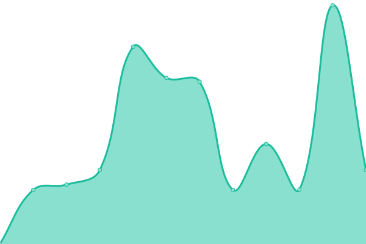 757ms
     
 | 

<a href="https://whytspace.github.io/upptime-holiday-lescala/history/el-gall-es">98.31%</a>
    

|  [Medinya 🇩🇪 (de)](https://holiday-lescala.com/h/haus-medinya/) | 🟩 Up | [medinya-de.yml](https://github.com/whytspace/upptime-holiday-lescala/commits/HEAD/history/medinya-de.yml) | 

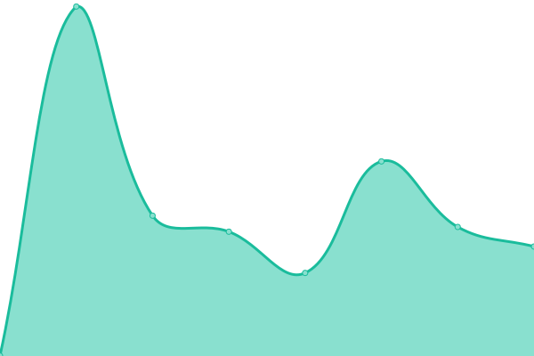 774ms
     
 | 

<a href="https://whytspace.github.io/upptime-holiday-lescala/history/medinya-de">98.35%</a>
    

|  [Medinya 🇬🇧 (en)](https://holiday-lescala.com/en/h/house-medinya/) | 🟩 Up | [medinya-en.yml](https://github.com/whytspace/upptime-holiday-lescala/commits/HEAD/history/medinya-en.yml) | 

 739ms
     
 | 

<a href="https://whytspace.github.io/upptime-holiday-lescala/history/medinya-en">98.39%</a>
    

|  [Medinya 🇫🇷 (fr)](https://holiday-lescala.com/fr/h/maison-medinya/) | 🟩 Up | [medinya-fr.yml](https://github.com/whytspace/upptime-holiday-lescala/commits/HEAD/history/medinya-fr.yml) | 

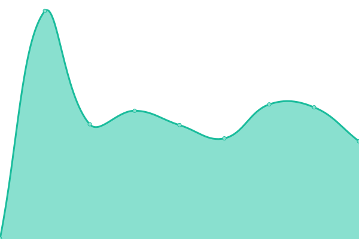 754ms
     
 | 

<a href="https://whytspace.github.io/upptime-holiday-lescala/history/medinya-fr">98.55%</a>
    

|  [Medinya 🇪🇸 (es)](https://holiday-lescala.com/es/h/casa-medinya/) | 🟩 Up | [medinya-es.yml](https://github.com/whytspace/upptime-holiday-lescala/commits/HEAD/history/medinya-es.yml) | 

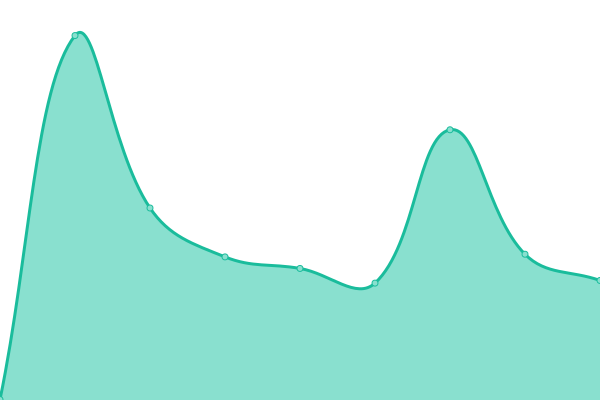 737ms
     
 | 

<a href="https://whytspace.github.io/upptime-holiday-lescala/history/medinya-es">98.58%</a>
    

|  [Le Coq 🇩🇪 (de)](https://holiday-lescala.com/h/haus-le-coq/) | 🟩 Up | [le-coq-de.yml](https://github.com/whytspace/upptime-holiday-lescala/commits/HEAD/history/le-coq-de.yml) | 

 702ms
     
 | 

<a href="https://whytspace.github.io/upptime-holiday-lescala/history/le-coq-de">98.62%</a>
    

|  [Le Coq 🇬🇧 (en)](https://holiday-lescala.com/en/h/house-le-coq/) | 🟩 Up | [le-coq-en.yml](https://github.com/whytspace/upptime-holiday-lescala/commits/HEAD/history/le-coq-en.yml) | 

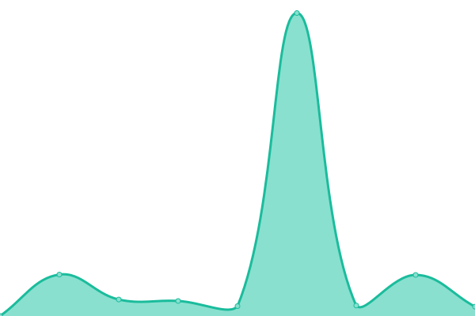 701ms
     
 | 

<a href="https://whytspace.github.io/upptime-holiday-lescala/history/le-coq-en">98.80%</a>
    

|  [Le Coq 🇫🇷 (fr)](https://holiday-lescala.com/fr/h/maison-le-coq/) | 🟩 Up | [le-coq-fr.yml](https://github.com/whytspace/upptime-holiday-lescala/commits/HEAD/history/le-coq-fr.yml) | 

 744ms
     
 | 

<a href="https://whytspace.github.io/upptime-holiday-lescala/history/le-coq-fr">98.83%</a>
    

|  [Le Coq 🇪🇸 (es)](https://holiday-lescala.com/es/h/casa-le-coq/) | 🟩 Up | [le-coq-es.yml](https://github.com/whytspace/upptime-holiday-lescala/commits/HEAD/history/le-coq-es.yml) | 

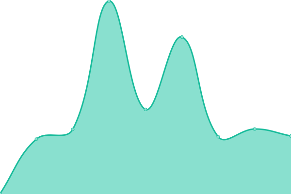 702ms
     
 | 

<a href="https://whytspace.github.io/upptime-holiday-lescala/history/le-coq-es">98.86%</a>
    

|  [Dorna 🇩🇪 (de)](https://holiday-lescala.com/h/haus-dorna/) | 🟩 Up | [dorna-de.yml](https://github.com/whytspace/upptime-holiday-lescala/commits/HEAD/history/dorna-de.yml) | 

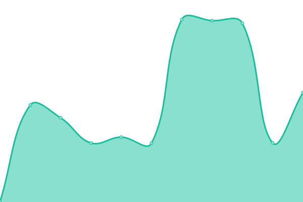 702ms
     
 | 

<a href="https://whytspace.github.io/upptime-holiday-lescala/history/dorna-de">99.03%</a>
    

|  [Dorna 🇬🇧 (en)](https://holiday-lescala.com/en/h/house-dorna/) | 🟩 Up | [dorna-en.yml](https://github.com/whytspace/upptime-holiday-lescala/commits/HEAD/history/dorna-en.yml) | 

 714ms
     
 | 

<a href="https://whytspace.github.io/upptime-holiday-lescala/history/dorna-en">99.05%</a>
    

|  [Dorna 🇫🇷 (fr)](https://holiday-lescala.com/fr/h/maison-dorna/) | 🟩 Up | [dorna-fr.yml](https://github.com/whytspace/upptime-holiday-lescala/commits/HEAD/history/dorna-fr.yml) | 

 737ms
     
 | 

<a href="https://whytspace.github.io/upptime-holiday-lescala/history/dorna-fr">99.08%</a>
    

|  [Dorna 🇪🇸 (es)](https://holiday-lescala.com/es/h/casa-dorna/) | 🟩 Up | [dorna-es.yml](https://github.com/whytspace/upptime-holiday-lescala/commits/HEAD/history/dorna-es.yml) | 

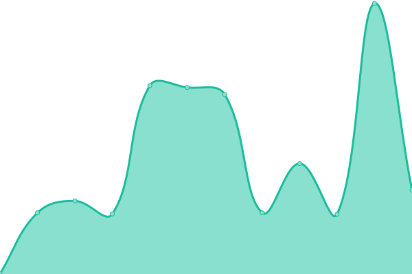 703ms
     
 | 

<a href="https://whytspace.github.io/upptime-holiday-lescala/history/dorna-es">99.10%</a>
    

<!--end: status pages-->

[**Visit our status website →**](https://whytspace.github.io/upptime-holiday-lescala/)

## 📄 License

- Powered by: [Upptime](https://github.com/upptime/upptime)
- Code: [MIT](./LICENSE) © [David H.](https://whytspace.github.io/upptime-holiday-lescala)
- Data in the `./history` directory: [Open Database License](https://opendatacommons.org/licenses/odbl/1-0/)
