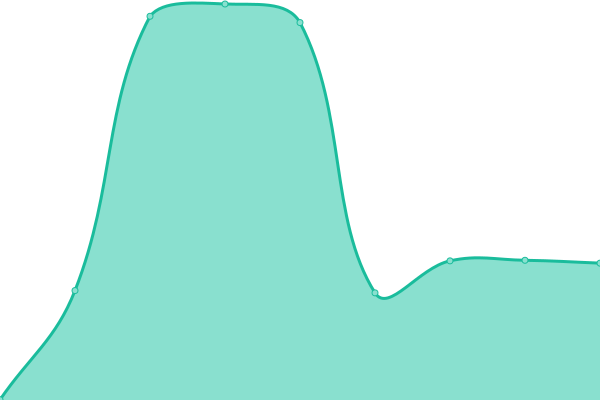
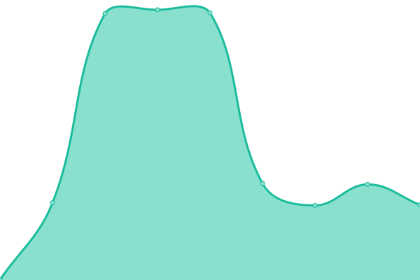
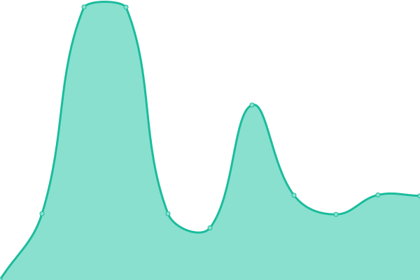
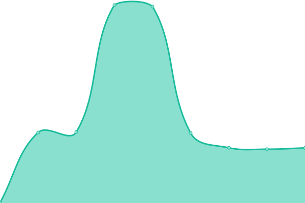
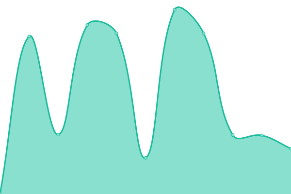
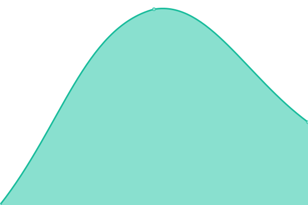

# [📈 Live Status](https://whytspace.github.io/upptime): <!--live status--> **🟩 All systems operational**

This repository contains the open-source uptime monitor and status page for [David H.](https://whytspace.github.io/upptime), powered by [Upptime](https://github.com/upptime/upptime).

With [Upptime](https://upptime.js.org), you can get your own unlimited and free uptime monitor and status page, powered entirely by a GitHub repository. We use [Issues](https://github.com/whytspace/upptime/issues) as incident reports, [Actions](https://github.com/whytspace/upptime/actions) as uptime monitors, and [Pages](https://whytspace.github.io/upptime) for the status page.

<!--start: status pages-->
<!-- This summary is generated by Upptime (https://github.com/upptime/upptime) -->
<!-- Do not edit this manually, your changes will be overwritten -->
<!-- prettier-ignore -->
| URL | Status | History | Response Time | Uptime |
| --- | ------ | ------- | ------------- | ------ |
|  [Übersicht 🇩🇪](https://holiday-lescala.com/haeuser/) | 🟩 Up | [uebersicht.yml](https://github.com/whytspace/upptime/commits/HEAD/history/uebersicht.yml) | 

 557ms
     
 | 

<a href="https://whytspace.github.io/upptime/history/uebersicht">100.00%</a>
    

|  [Übersicht 🇬🇧](https://holiday-lescala.com/en/homes/) | 🟩 Up | [uebersicht.yml](https://github.com/whytspace/upptime/commits/HEAD/history/uebersicht.yml) | 

 557ms
     
 | 

<a href="https://whytspace.github.io/upptime/history/uebersicht">100.00%</a>
    

|  [Übersicht 🇫🇷](https://holiday-lescala.com/fr/maisons/) | 🟩 Up | [uebersicht.yml](https://github.com/whytspace/upptime/commits/HEAD/history/uebersicht.yml) | 

 557ms
     
 | 

<a href="https://whytspace.github.io/upptime/history/uebersicht">100.00%</a>
    

|  [Übersicht 🇪🇸](https://holiday-lescala.com/es/casas/) | 🟩 Up | [uebersicht.yml](https://github.com/whytspace/upptime/commits/HEAD/history/uebersicht.yml) | 

 557ms
     
 | 

<a href="https://whytspace.github.io/upptime/history/uebersicht">100.00%</a>
    

|  [Bianya 🇩🇪](https://holiday-lescala.com/h/haus-bianya/) | 🟩 Up | [bianya.yml](https://github.com/whytspace/upptime/commits/HEAD/history/bianya.yml) | 

 1120ms
     
 | 

<a href="https://whytspace.github.io/upptime/history/bianya">100.00%</a>
    

|  [Bianya 🇬🇧](https://holiday-lescala.com/en/h/house-bianya/) | 🟩 Up | [bianya.yml](https://github.com/whytspace/upptime/commits/HEAD/history/bianya.yml) | 

 1120ms
     
 | 

<a href="https://whytspace.github.io/upptime/history/bianya">100.00%</a>
    

|  [Bianya 🇫🇷](https://holiday-lescala.com/fr/h/maison-bianya/) | 🟩 Up | [bianya.yml](https://github.com/whytspace/upptime/commits/HEAD/history/bianya.yml) | 

 1120ms
     
 | 

<a href="https://whytspace.github.io/upptime/history/bianya">100.00%</a>
    

|  [Bianya 🇪🇸](https://holiday-lescala.com/es/h/casa-bianya/) | 🟩 Up | [bianya.yml](https://github.com/whytspace/upptime/commits/HEAD/history/bianya.yml) | 

 1120ms
     
 | 

<a href="https://whytspace.github.io/upptime/history/bianya">100.00%</a>
    

|  [Girasol 🇩🇪](https://holiday-lescala.com/h/haus-girasol/) | 🟩 Up | [girasol.yml](https://github.com/whytspace/upptime/commits/HEAD/history/girasol.yml) | 

 1108ms
     
 | 

<a href="https://whytspace.github.io/upptime/history/girasol">100.00%</a>
    

|  [Girasol 🇬🇧](https://holiday-lescala.com/en/h/house-girasol/) | 🟩 Up | [girasol.yml](https://github.com/whytspace/upptime/commits/HEAD/history/girasol.yml) | 

 1108ms
     
 | 

<a href="https://whytspace.github.io/upptime/history/girasol">100.00%</a>
    

|  [Girasol 🇫🇷](https://holiday-lescala.com/fr/h/maison-girasol/) | 🟩 Up | [girasol.yml](https://github.com/whytspace/upptime/commits/HEAD/history/girasol.yml) | 

 1108ms
     
 | 

<a href="https://whytspace.github.io/upptime/history/girasol">100.00%</a>
    

|  [Girasol 🇪🇸](https://holiday-lescala.com/es/h/casa-girasol/) | 🟩 Up | [girasol.yml](https://github.com/whytspace/upptime/commits/HEAD/history/girasol.yml) | 

 1108ms
     
 | 

<a href="https://whytspace.github.io/upptime/history/girasol">100.00%</a>
    

|  [Olives 🇩🇪](https://holiday-lescala.com/h/haus-olives/) | 🟩 Up | [olives.yml](https://github.com/whytspace/upptime/commits/HEAD/history/olives.yml) | 

 1114ms
     
 | 

<a href="https://whytspace.github.io/upptime/history/olives">100.00%</a>
    

|  [Olives 🇬🇧](https://holiday-lescala.com/en/h/house-olives/) | 🟩 Up | [olives.yml](https://github.com/whytspace/upptime/commits/HEAD/history/olives.yml) | 

 1114ms
     
 | 

<a href="https://whytspace.github.io/upptime/history/olives">100.00%</a>
    

|  [Olives 🇫🇷](https://holiday-lescala.com/fr/h/maison-olives/) | 🟩 Up | [olives.yml](https://github.com/whytspace/upptime/commits/HEAD/history/olives.yml) | 

 1114ms
     
 | 

<a href="https://whytspace.github.io/upptime/history/olives">100.00%</a>
    

|  [Olives 🇪🇸](https://holiday-lescala.com/es/h/casa-olives/) | 🟩 Up | [olives.yml](https://github.com/whytspace/upptime/commits/HEAD/history/olives.yml) | 

 1114ms
     
 | 

<a href="https://whytspace.github.io/upptime/history/olives">100.00%</a>
    

|  [Francoli 🇩🇪](https://holiday-lescala.com/h/haus-francoli/) | 🟩 Up | [francoli.yml](https://github.com/whytspace/upptime/commits/HEAD/history/francoli.yml) | 

 1101ms
     
 | 

<a href="https://whytspace.github.io/upptime/history/francoli">100.00%</a>
    

|  [Francoli 🇬🇧](https://holiday-lescala.com/en/h/house-francoli/) | 🟩 Up | [francoli.yml](https://github.com/whytspace/upptime/commits/HEAD/history/francoli.yml) | 

 1101ms
     
 | 

<a href="https://whytspace.github.io/upptime/history/francoli">100.00%</a>
    

|  [Francoli 🇫🇷](https://holiday-lescala.com/fr/h/maison-francoli/) | 🟩 Up | [francoli.yml](https://github.com/whytspace/upptime/commits/HEAD/history/francoli.yml) | 

 1101ms
     
 | 

<a href="https://whytspace.github.io/upptime/history/francoli">100.00%</a>
    

|  [Francoli 🇪🇸](https://holiday-lescala.com/es/h/casa-francoli/) | 🟩 Up | [francoli.yml](https://github.com/whytspace/upptime/commits/HEAD/history/francoli.yml) | 

 1101ms
     
 | 

<a href="https://whytspace.github.io/upptime/history/francoli">100.00%</a>
    

|  [Terany 🇩🇪](https://holiday-lescala.com/h/haus-terany/) | 🟩 Up | [terany.yml](https://github.com/whytspace/upptime/commits/HEAD/history/terany.yml) | 

 1104ms
     
 | 

<a href="https://whytspace.github.io/upptime/history/terany">100.00%</a>
    

|  [Terany 🇬🇧](https://holiday-lescala.com/en/h/house-terany/) | 🟩 Up | [terany.yml](https://github.com/whytspace/upptime/commits/HEAD/history/terany.yml) | 

 1104ms
     
 | 

<a href="https://whytspace.github.io/upptime/history/terany">100.00%</a>
    

|  [Terany 🇫🇷](https://holiday-lescala.com/fr/h/maison-terany/) | 🟩 Up | [terany.yml](https://github.com/whytspace/upptime/commits/HEAD/history/terany.yml) | 

 1104ms
     
 | 

<a href="https://whytspace.github.io/upptime/history/terany">100.00%</a>
    

|  [Terany 🇪🇸](https://holiday-lescala.com/es/h/casa-terany/) | 🟩 Up | [terany.yml](https://github.com/whytspace/upptime/commits/HEAD/history/terany.yml) | 

 1104ms
     
 | 

<a href="https://whytspace.github.io/upptime/history/terany">100.00%</a>
    

|  [Roca 🇩🇪](https://holiday-lescala.com/h/haus-roca/) | 🟩 Up | [roca.yml](https://github.com/whytspace/upptime/commits/HEAD/history/roca.yml) | 

 893ms
     
 | 

<a href="https://whytspace.github.io/upptime/history/roca">100.00%</a>
    

|  [Roca 🇬🇧](https://holiday-lescala.com/en/h/house-roca/) | 🟩 Up | [roca.yml](https://github.com/whytspace/upptime/commits/HEAD/history/roca.yml) | 

 893ms
     
 | 

<a href="https://whytspace.github.io/upptime/history/roca">100.00%</a>
    

|  [Roca 🇫🇷](https://holiday-lescala.com/fr/h/maison-roca/) | 🟩 Up | [roca.yml](https://github.com/whytspace/upptime/commits/HEAD/history/roca.yml) | 

 893ms
     
 | 

<a href="https://whytspace.github.io/upptime/history/roca">100.00%</a>
    

|  [Roca 🇪🇸](https://holiday-lescala.com/es/h/casa-roca/) | 🟩 Up | [roca.yml](https://github.com/whytspace/upptime/commits/HEAD/history/roca.yml) | 

 893ms
     
 | 

<a href="https://whytspace.github.io/upptime/history/roca">100.00%</a>
    

|  [Ancora 🇩🇪](https://holiday-lescala.com/h/haus-ancora/) | 🟩 Up | [ancora.yml](https://github.com/whytspace/upptime/commits/HEAD/history/ancora.yml) | 

 969ms
     
 | 

<a href="https://whytspace.github.io/upptime/history/ancora">87.80%</a>
    

|  [Ancora 🇬🇧](https://holiday-lescala.com/en/h/house-ancora/) | 🟩 Up | [ancora.yml](https://github.com/whytspace/upptime/commits/HEAD/history/ancora.yml) | 

 969ms
     
 | 

<a href="https://whytspace.github.io/upptime/history/ancora">87.94%</a>
    

|  [Ancora 🇫🇷](https://holiday-lescala.com/fr/h/maison-ancora/) | 🟩 Up | [ancora.yml](https://github.com/whytspace/upptime/commits/HEAD/history/ancora.yml) | 

 969ms
     
 | 

<a href="https://whytspace.github.io/upptime/history/ancora">88.05%</a>
    

|  [Ancora 🇪🇸](https://holiday-lescala.com/es/h/casa-ancora/) | 🟩 Up | [ancora.yml](https://github.com/whytspace/upptime/commits/HEAD/history/ancora.yml) | 

 969ms
     
 | 

<a href="https://whytspace.github.io/upptime/history/ancora">88.14%</a>
    

|  [Can Llop 🇩🇪](https://holiday-lescala.com/h/haus-can-llop/) | 🟩 Up | [can-llop.yml](https://github.com/whytspace/upptime/commits/HEAD/history/can-llop.yml) | 

 1080ms
     
 | 

<a href="https://whytspace.github.io/upptime/history/can-llop">100.00%</a>
    

|  [El Gall 🇩🇪](https://holiday-lescala.com/h/haus-el-gall/) | 🟩 Up | [el-gall.yml](https://github.com/whytspace/upptime/commits/HEAD/history/el-gall.yml) | 

 924ms
     
 | 

<a href="https://whytspace.github.io/upptime/history/el-gall">100.00%</a>
    

|  [El Gall 🇬🇧](https://holiday-lescala.com/en/h/house-el-gall/) | 🟩 Up | [el-gall.yml](https://github.com/whytspace/upptime/commits/HEAD/history/el-gall.yml) | 

 924ms
     
 | 

<a href="https://whytspace.github.io/upptime/history/el-gall">100.00%</a>
    

|  [El Gall 🇫🇷](https://holiday-lescala.com/fr/h/maison-el-gall/) | 🟩 Up | [el-gall.yml](https://github.com/whytspace/upptime/commits/HEAD/history/el-gall.yml) | 

 924ms
     
 | 

<a href="https://whytspace.github.io/upptime/history/el-gall">100.00%</a>
    

|  [El Gall 🇪🇸](https://holiday-lescala.com/es/h/casa-el-gall/) | 🟩 Up | [el-gall.yml](https://github.com/whytspace/upptime/commits/HEAD/history/el-gall.yml) | 

 924ms
     
 | 

<a href="https://whytspace.github.io/upptime/history/el-gall">100.00%</a>
    

|  [Medinya 🇩🇪](https://holiday-lescala.com/h/haus-medinya/) | 🟩 Up | [medinya.yml](https://github.com/whytspace/upptime/commits/HEAD/history/medinya.yml) | 

 1094ms
     
 | 

<a href="https://whytspace.github.io/upptime/history/medinya">100.00%</a>
    

|  [Medinya 🇬🇧](https://holiday-lescala.com/en/h/house-medinya/) | 🟩 Up | [medinya.yml](https://github.com/whytspace/upptime/commits/HEAD/history/medinya.yml) | 

 1094ms
     
 | 

<a href="https://whytspace.github.io/upptime/history/medinya">100.00%</a>
    

|  [Medinya 🇫🇷](https://holiday-lescala.com/fr/h/maison-medinya/) | 🟩 Up | [medinya.yml](https://github.com/whytspace/upptime/commits/HEAD/history/medinya.yml) | 

 1094ms
     
 | 

<a href="https://whytspace.github.io/upptime/history/medinya">100.00%</a>
    

|  [Medinya 🇪🇸](https://holiday-lescala.com/es/h/casa-medinya/) | 🟩 Up | [medinya.yml](https://github.com/whytspace/upptime/commits/HEAD/history/medinya.yml) | 

 1094ms
     
 | 

<a href="https://whytspace.github.io/upptime/history/medinya">100.00%</a>
    

|  [Le Coq 🇩🇪](https://holiday-lescala.com/h/haus-le-coq/) | 🟩 Up | [le-coq.yml](https://github.com/whytspace/upptime/commits/HEAD/history/le-coq.yml) | 

 1128ms
     
 | 

<a href="https://whytspace.github.io/upptime/history/le-coq">100.00%</a>
    

|  [Le Coq 🇬🇧](https://holiday-lescala.com/en/h/house-le-coq/) | 🟩 Up | [le-coq.yml](https://github.com/whytspace/upptime/commits/HEAD/history/le-coq.yml) | 

 1128ms
     
 | 

<a href="https://whytspace.github.io/upptime/history/le-coq">100.00%</a>
    

|  [Le Coq 🇫🇷](https://holiday-lescala.com/fr/h/maison-le-coq/) | 🟩 Up | [le-coq.yml](https://github.com/whytspace/upptime/commits/HEAD/history/le-coq.yml) | 

 1128ms
     
 | 

<a href="https://whytspace.github.io/upptime/history/le-coq">100.00%</a>
    

|  [Le Coq 🇪🇸](https://holiday-lescala.com/es/h/casa-le-coq/) | 🟩 Up | [le-coq.yml](https://github.com/whytspace/upptime/commits/HEAD/history/le-coq.yml) | 

 1128ms
     
 | 

<a href="https://whytspace.github.io/upptime/history/le-coq">100.00%</a>
    

|  [Dorna 🇩🇪](https://holiday-lescala.com/h/haus-dorna/) | 🟩 Up | [dorna.yml](https://github.com/whytspace/upptime/commits/HEAD/history/dorna.yml) | 

 1146ms
     
 | 

<a href="https://whytspace.github.io/upptime/history/dorna">100.00%</a>
    

<!--end: status pages-->

[**Visit our status website →**](https://whytspace.github.io/upptime)

## 📄 License

- Powered by: [Upptime](https://github.com/upptime/upptime)
- Code: [MIT](./LICENSE) © [David H.](https://whytspace.github.io/upptime)
- Data in the `./history` directory: [Open Database License](https://opendatacommons.org/licenses/odbl/1-0/)
